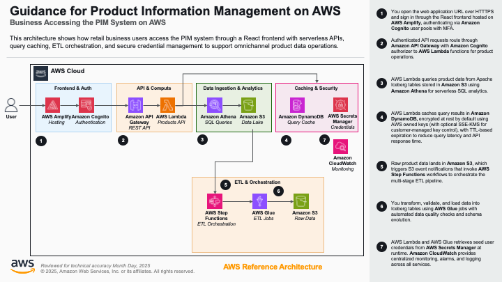

# Guidance for Product Information Management on AWS

## Table of Contents

1. [Overview](#overview)
    - [Cost](#cost)
2. [Prerequisites](#prerequisites)
    - [Operating System](#operating-system)
    - [Third-party Tools](#third-party-tools)
    - [AWS Account Requirements](#aws-account-requirements)
    - [AWS CDK Bootstrap](#aws-cdk-bootstrap)
    - [Supported Regions](#supported-regions)
3. [Automated Deployment](#automated-deployment)
4. [Manual Deployment](#manual-deployment)
5. [Deployment Validation](#deployment-validation)
6. [Running the Guidance](#running-the-guidance)
7. [Next Steps](#next-steps)
8. [Cleanup](#cleanup)
9. [Notices](#notices)
10. [FAQ, Known Issues, Additional Considerations, and Limitations](#faq-known-issues-additional-considerations-and-limitations)
11. [Revisions](#revisions)
12. [Authors](#authors)

## Overview

This Guidance provides a lean, extensible Product Information Management (PIM) system blueprint built on AWS serverless technologies. It solves the challenge of managing large product catalogs with consistent data quality by combining an **Apache Iceberg** data lake on **Amazon S3**, a two-tier data quality pipeline using **AWS Glue**, and a RESTful API backed by **Amazon Athena** parameterized queries. A React frontend with **Amazon Cognito** authentication provides role-based product management, while **AWS Step Functions** orchestrates the ETL and data quality workflow end-to-end.



The architecture works as follows:

1. Users access the React frontend hosted via **AWS Amplify**, which authenticates through **Amazon Cognito** (Editors and Viewers groups).
2. The frontend calls the REST API on **Amazon API Gateway**, which is protected by a Cognito authorizer.
3. **AWS Lambda** handles API requests, executing parameterized SQL queries against **Amazon Athena** with result caching.
4. Athena queries the **Apache Iceberg** tables stored in the **Amazon S3** data lake.
5. Raw product data is uploaded to an S3 ingestion bucket by various means. A data pipeline is triggerered using the **AWS Step Functions** workflow.
6. The workflow orchestrates **AWS Glue** ETL (data transformation), Tier 1 Data Quality (DQDL rules for completeness, format, range, uniqueness), and Tier 2 Data Quality (custom business rules for category assignment, required attributes, brand validation).
7. Data quality results are stored in S3 Athena Tables and surfaced through the API for dashboard viewing, inline correction, CSV bulk upload, and reprocessing.
8. **AWS Secrets Manager** stores auto-generated seed user credentials. **Amazon CloudWatch** provides logging and monitoring across all components.

### Cost

_You are responsible for the cost of the AWS services used while running this Guidance. As of March 2026, the cost for running this Guidance with the default settings in the US East (N. Virginia) Region is approximately $188.00 per month for managing a mid-size catalog of approximately 50,000 products._

The following table provides a sample cost breakdown for deploying this Guidance with the default parameters in the US East (N. Virginia) Region for one month.

| AWS Service | Dimensions | Cost [USD] |
| ----------- | ---------- | ---------- |
| **Amazon S3** | 100 GB storage + 300K PUT requests + 500K GET requests | $4.00 |
| **Amazon Athena** | 100 queries/day × 30 days × 10 GB/query | $148.54 |
| **AWS Glue** | 2 jobs × 2 runs/day × 10 min × 2 DPU × 30 days | $35.20 |
| **AWS Lambda** | 100K invocations × 500 ms × 512 MB (free tier eligible) | $0.00 |
| **Amazon API Gateway** | 100K REST API calls per month | $0.35 |
| **AWS Step Functions** | 60 executions/month × 6 transitions (free tier eligible) | $0.00 |
| **AWS Secrets Manager** | 1 secret + API calls | $0.40 |
| **Total** | | **~$188.00** |

**Cost optimization tips:**
- **Athena result caching**: The API implements query result caching. Repeated queries reuse cached results instead of re-scanning, significantly reducing Athena costs.
- **Iceberg partitioning**: Tables are partitioned by `status` to minimize data scanned per query.
- **Glue auto-scaling**: Jobs use 2 DPU minimum. Increase only for larger datasets.
- **Reserved capacity**: For production, consider Athena provisioned capacity if running more than 200 queries per day.

_We recommend creating a [Budget](https://docs.aws.amazon.com/cost-management/latest/userguide/budgets-managing-costs.html) through [AWS Cost Explorer](https://aws.amazon.com/aws-cost-management/aws-cost-explorer/) to help manage costs. Prices are subject to change. For full details, refer to the pricing webpage for each AWS service used in this Guidance._

For a detailed interactive cost breakdown, see the [AWS Pricing Calculator estimate](https://calculator.aws/#/estimate?id=86299af4e1be0daa8df0560f9ece91367d65750f).

## Prerequisites

### Operating System

These deployment instructions are optimized to best work on **Amazon Linux 2023**. Deployment on macOS or other Linux distributions may require additional steps.

The following packages are required:

| Package | Version | Install Command |
| ------- | ------- | --------------- |
| Python | 3.9+ | Pre-installed on Amazon Linux 2023 |
| Node.js | 16+ | `sudo yum install -y nodejs` |
| AWS CLI | 2.x | Pre-installed on Amazon Linux 2023 |
| AWS CDK CLI | 2.x | `npm install -g aws-cdk` |
| pip | Latest | `python3 -m ensurepip --upgrade` |

### Third-party Tools

- **Apache Iceberg**: Used as the table format for the S3 data lake. No separate installation required; AWS Glue provides native Iceberg support.
- **React**: Frontend framework. Dependencies are installed via `npm install` in the `source/frontend/` directory.

### AWS Account Requirements

- An AWS account with permissions to create the following resources: S3 buckets, Lambda functions, API Gateway REST APIs, Glue jobs and databases, Step Functions state machines, Athena workgroups, Cognito user pools, Secrets Manager secrets, DynamoDB tables, CloudWatch log groups, IAM roles and policies, and Amplify applications.
- AWS CLI configured with credentials that have `AdministratorAccess` or equivalent permissions for CDK deployment.

### AWS CDK Bootstrap

This Guidance uses AWS CDK. If you are using AWS CDK for the first time in your account and Region, run the following bootstrap command:

```bash
cdk bootstrap aws://<ACCOUNT_ID>/<REGION>
```

For example:

```bash
cdk bootstrap aws://123456789012/us-east-1
```

### Supported Regions

This Guidance can be deployed in any AWS Region that supports all required services. The following Regions have been tested:

- US East (N. Virginia) — `us-east-1`
- Asia Pacific (Sydney) — `ap-southeast-2`

## Automated Deployment

For automated deployment, a one-click deploy script (`deployment/deploy.sh`) is available. This script automates all deployment steps including dependency installation, CDK deployment, Iceberg table creation, reference data population, mock data upload, ETL pipeline execution, and API validation.

**Usage:**

```bash
# Clone the repository
git clone https://github.com/aws-solutions-library-samples/guidance-for-product-information-management-on-aws.git
cd guidance-for-product-information-management-on-aws

# Make the script executable and run it
chmod +x deployment/deploy.sh
./deployment/deploy.sh
```

**What the script does:**
1. Installs Python dependencies from `requirements.txt`
2. Checks for CDK bootstrap and bootstraps if needed
3. Deploys the CDK stack (`pim-on-aws`) with all infrastructure
4. Retrieves stack outputs (API URL, bucket names, Cognito IDs)
5. Retrieves seed user credentials from **AWS Secrets Manager**
6. Creates Apache Iceberg tables in the data lake
7. Populates reference data (categories, brands, attributes) from the YAML configuration
8. Uploads mock product data to the S3 ingestion bucket
9. Triggers the ETL and Data Quality pipeline via **AWS Step Functions** and waits for completion
10. Runs API validation tests against the deployed endpoints

**Environment:**
- Designed for AWS CodeBuild environments running Amazon Linux 2023
- Can also run on Amazon Linux 2023 EC2 instances or local environments with AWS CLI configured
- Targets `us-east-1` Region by default
- Requires AWS credentials with sufficient permissions

**Note:** For a detailed understanding of each deployment step, see the [Manual Deployment](#manual-deployment) section below.

## Manual Deployment

This section provides step-by-step instructions for manual deployment. Use this if you want to understand each step in detail or customize the deployment process.

1. Clone the repository:
   ```bash
   git clone https://github.com/aws-solutions-library-samples/guidance-for-product-information-management-on-aws.git
   ```

2. Navigate to the repository directory:
   ```bash
   cd guidance-for-product-information-management-on-aws
   ```

3. Install Python dependencies:
   ```bash
   pip install -r requirements.txt
   ```

4. Bootstrap CDK (first time only):
   ```bash
   cdk bootstrap aws://<ACCOUNT_ID>/us-east-1
   ```

5. Deploy the CDK stack:
   ```bash
   cdk deploy pim-on-aws --require-approval never
   ```

6. Capture the stack outputs for use in subsequent steps:
   ```bash
   export BUCKET=$(aws cloudformation describe-stacks --stack-name pim-on-aws \
     --query "Stacks[0].Outputs[?OutputKey=='DataLakeBucketName'].OutputValue" --output text)
   export API_URL=$(aws cloudformation describe-stacks --stack-name pim-on-aws \
     --query "Stacks[0].Outputs[?OutputKey=='ApiGatewayUrl'].OutputValue" --output text)
   export USER_POOL_ID=$(aws cloudformation describe-stacks --stack-name pim-on-aws \
     --query "Stacks[0].Outputs[?OutputKey=='UserPoolId'].OutputValue" --output text)
   export CLIENT_ID=$(aws cloudformation describe-stacks --stack-name pim-on-aws \
     --query "Stacks[0].Outputs[?OutputKey=='UserPoolClientId'].OutputValue" --output text)
   export GLUE_DATABASE=$(aws cloudformation describe-stacks --stack-name pim-on-aws \
     --query "Stacks[0].Outputs[?OutputKey=='GlueCatalogName'].OutputValue" --output text)
   export ETL_WORKFLOW_ARN=$(aws cloudformation describe-stacks --stack-name pim-on-aws \
     --query "Stacks[0].Outputs[?OutputKey=='EtlWorkflowArn'].OutputValue" --output text)
   ```

7. Retrieve seed user credentials from **AWS Secrets Manager**:
   ```bash
   aws secretsmanager get-secret-value \
     --secret-id pim-seed-user-credentials \
     --query SecretString --output text | python3 -m json.tool
   ```

8. Create the Apache Iceberg tables in the data lake:
   ```bash
   python3 source/scripts/manage_iceberg_tables.py \
     --action recreate-all \
     --bucket "$BUCKET" \
     --database "$GLUE_DATABASE" \
     --region us-east-1
   ```

9. Populate reference data (categories, brands, attributes) from the YAML configuration:
   ```bash
   python3 source/scripts/populate_base_tables.py \
     --config source/config/bookstore-production-config.yaml \
     --stack-name pim-on-aws \
     --region us-east-1
   ```

10. Upload mock product data to the S3 ingestion bucket:
    ```bash
    for f in source/mock-data/*.json; do
      aws s3 cp "$f" "s3://$BUCKET/raw/products/"
    done
    ```

11. Trigger the ETL and Data Quality pipeline:
    ```bash
    EXEC_ARN=$(aws stepfunctions start-execution \
      --state-machine-arn "$ETL_WORKFLOW_ARN" \
      --query 'executionArn' --output text)
    echo "Execution ARN: $EXEC_ARN"
    ```

12. Wait for the pipeline to complete (approximately 3-5 minutes):
    ```bash
    aws stepfunctions describe-execution \
      --execution-arn "$EXEC_ARN" \
      --query 'status' --output text
    ```
    Repeat until the status shows `SUCCEEDED`.

## Deployment Validation

After deployment, verify the stack was created successfully:

1. Check the CloudFormation stack status:
   ```bash
   aws cloudformation describe-stacks --stack-name pim-on-aws \
     --query 'Stacks[0].StackStatus' --output text
   ```
   Expected output: `CREATE_COMPLETE` or `UPDATE_COMPLETE`

2. Verify the API Gateway endpoint is responding:
   ```bash
   curl -s -o /dev/null -w "%{http_code}" "$API_URL/api/v1/stats"
   ```
   Expected output: `401` (authentication required, confirming the endpoint is active and protected)

3. Verify the data lake bucket exists:
   ```bash
   aws s3 ls "s3://$BUCKET/" --region us-east-1
   ```
   You should see `raw/` and `warehouse/` prefixes.

4. Verify the Cognito user pool has seed users:
   ```bash
   aws cognito-idp list-users --user-pool-id "$USER_POOL_ID" \
     --query 'Users[].Username' --output text
   ```
   Expected output: `admin` (and optionally `viewer`)

5. Verify the Step Functions execution completed:
   ```bash
   aws stepfunctions describe-execution \
     --execution-arn "$EXEC_ARN" \
     --query 'status' --output text
   ```
   Expected output: `SUCCEEDED`

## Running the Guidance

### Running API Tests

The Guidance includes integration tests that validate the deployed API endpoints. The `deploy.sh` script runs these automatically, but you can also run them manually:

```bash
# Set environment variables
export API_BASE_URL="$API_URL"
export TEST_USERNAME=admin
export TEST_PASSWORD=<password-from-secrets-manager>

# Run the full test suite
python3 source/tests/test_products_api.py
```

Expected output: All API CRUD operations (create, read, update, delete products) and data quality endpoints pass successfully.

### Accessing the Application

After a successful deployment, two user personas are created in the **Amazon Cognito** user pool:

| User | Role | Permissions |
|------|------|-------------|
| `admin` | Editor | Full CRUD access to products, data quality management, ETL triggers |
| `viewer` | Viewer | Read-only access to products and dashboards |

To get started:

1. Retrieve the login credentials from **AWS Secrets Manager**:
   ```bash
   aws secretsmanager get-secret-value \
     --secret-id pim-seed-user-credentials \
     --query SecretString --output text | python3 -m json.tool
   ```

2. Open the **AWS Amplify** console, navigate to the `pim-on-aws` app, and click the URL for the `main` branch (e.g., `https://main.<app-id>.amplifyapp.com`). Alternatively, retrieve the URL from the deploy script output or stack outputs.

3. Log in with the `admin` or `viewer` credentials from Step 1.

### Frontend Capabilities

The React frontend provides a complete product information management interface:

- **Product Catalog** — Browse, search, and filter products by status, brand, category, or free text
- **Product Management** — Create, edit, and soft-delete products (Editor role only)
- **Data Quality Dashboard** — View DQ run history, failure metrics, and trend analysis
- **Failed Record Correction** — Inspect DQ-failed records inline, fix individual fields, or export/upload CSV for bulk corrections
- **DQ Reprocessing** — Trigger revalidation of corrected records through the data quality pipeline
- **ETL Pipeline Control** — Monitor pipeline execution status and trigger new ETL runs
- **Work Queues** — Access categorized queues for drafts, incomplete records, low-stock items, and recently updated products

### Running the Frontend Locally

1. Navigate to the frontend directory and install dependencies:
   ```bash
   cd source/frontend
   npm install
   ```

2. Start the development server:
   ```bash
   npm start
   ```

3. Open `http://localhost:3000` in your browser.

4. Log in with the seed user credentials retrieved from **AWS Secrets Manager** in Step 7 of the Manual Deployment.

5. From the dashboard, you can:
   - Browse and search products by status, brand, category, or free text
   - Create, edit, and soft-delete products (Editors group)
   - View data quality dashboard with run history and failure metrics
   - Correct failed records inline or export/upload CSV for bulk corrections
   - Trigger data quality reprocessing after corrections

### API Endpoints

| Method | Endpoint | Description |
|--------|----------|-------------|
| GET | `/api/v1/products` | List products (filter by status, brand, category, search) |
| GET | `/api/v1/products/{id}` | Get product with attributes, categories, media |
| POST | `/api/v1/products` | Create product |
| PUT | `/api/v1/products/{id}` | Update product |
| DELETE | `/api/v1/products/{id}` | Soft delete product |
| GET | `/api/v1/products/search?q=term` | Quick search |
| POST | `/api/v1/products/search/advanced` | Advanced search with attribute filters |
| GET | `/api/v1/stats` | Dashboard statistics |
| GET | `/api/v1/queues/{type}` | Work queues (dq-failed, drafts, incomplete, low-stock, recent) |
| GET | `/api/v1/categories` | List categories (hierarchical) |
| GET | `/api/v1/data-quality/dashboard` | DQ run history and metrics |
| GET | `/api/v1/data-quality/failed-records` | Failed records list |
| GET | `/api/v1/data-quality/export-failed` | Export CSV for bulk correction |
| PUT | `/api/v1/data-quality/correct-record/{id}` | Fix single record |
| POST | `/api/v1/data-quality/upload-corrections` | Bulk CSV upload |
| POST | `/api/v1/data-quality/reprocess` | Trigger DQ revalidation |

## Next Steps

After deploying this Guidance, consider the following customizations:

- **Industry configuration**: The blueprint ships with a bookstore vertical (`source/config/bookstore-production-config.yaml`). Copy and edit the YAML file with your own categories, brands, and attribute definitions, then redeploy with `./deploy.sh fresh`.
- **Advanced search**: Deploy the optional **Amazon OpenSearch Service** extension for faceted filtering and full-text search across product attributes.
- **Business intelligence**: Add **Amazon QuickSight** Enterprise for advanced analytics dashboards on product catalog metrics.
- **Custom data quality rules**: Extend `source/glue_jobs/custom_data_quality_job.py` with business rules specific to your industry (e.g., regulatory compliance checks, cross-field validation).
- **CI/CD pipeline**: Set up **AWS CodePipeline** with **AWS CodeBuild** to automate deployments using the `deployment/deploy.sh` script.
- **Production hardening**: Review the [Solution Blueprint](assets/docs/SOLUTION_BLUEPRINT.md) for architecture details, known gaps, and production readiness recommendations.

## Cleanup

To remove all resources created by this Guidance:

1. Empty the S3 data lake bucket (CDK cannot delete non-empty buckets):
   ```bash
   BUCKET=$(aws cloudformation describe-stacks --stack-name pim-on-aws \
     --query "Stacks[0].Outputs[?OutputKey=='DataLakeBucketName'].OutputValue" --output text)
   aws s3 rm "s3://$BUCKET" --recursive
   ```

2. Empty the Athena results bucket:
   ```bash
   ATHENA_BUCKET=$(aws cloudformation describe-stacks --stack-name pim-on-aws \
     --query "Stacks[0].Outputs[?OutputKey=='AthenaResultsBucketName'].OutputValue" --output text)
   aws s3 rm "s3://$ATHENA_BUCKET" --recursive
   ```

3. Destroy the CDK stack:
   ```bash
   cdk destroy pim-on-aws --force
   ```

4. Verify the stack has been deleted:
   ```bash
   aws cloudformation describe-stacks --stack-name pim-on-aws 2>&1
   ```
   Expected output: An error indicating the stack does not exist.

5. (Optional) Remove the CDK bootstrap stack if no longer needed:
   ```bash
   cdk destroy CDKToolkit --force
   ```

**Note:** The **AWS Secrets Manager** secret (`pim-seed-user-credentials`) has a recovery window. If you need to immediately delete it, use:
```bash
aws secretsmanager delete-secret --secret-id pim-seed-user-credentials --force-delete-without-recovery
```

## FAQ, Known Issues, Additional Considerations, and Limitations

**Known Issues:**
- The Athena query result cache has a default TTL. If you update product data and do not see changes immediately in the API, wait for the cache to expire or clear the Athena results bucket.
- The Step Functions ETL pipeline takes 3-5 minutes to complete. API queries against the data lake return stale data until the pipeline finishes.

**Additional Considerations:**
- This Guidance creates **Amazon S3** buckets with `BlockPublicAccess.BLOCK_ALL` enabled and server-side encryption.
- This Guidance creates an **Amazon Cognito** user pool with seed user credentials stored in **AWS Secrets Manager**. Change the seed passwords after initial deployment for production use.
- The **AWS Glue** jobs use 2 DPU minimum. For catalogs larger than 100,000 products, increase the DPU allocation in the CDK stack configuration.
- The dataset included (`source/mock-data/test_data1.json`) is synthetic sample data for demonstration purposes.

**Security Considerations:**

The following items use permissive defaults to simplify initial deployment and local development. **You must restrict them before any production or internet-facing deployment:**

- **CORS — API Gateway and Lambda responses:** The API Gateway is configured with `Cors.ALL_ORIGINS` and the Lambda response headers return `Access-Control-Allow-Origin: *`. For production, scope the allowed origin to your actual frontend domain (e.g., your Amplify or CloudFront URL) in both `source/pim_system/infrastructure/core_stack.py` (API Gateway CORS options) and the `create_response()` helper in each Lambda function.
- **CORS — S3 Assets Bucket:** The assets S3 bucket allows `allowed_origins=["*"]` for GET/PUT/POST. For production, replace `"*"` with your frontend's domain in `source/pim_system/infrastructure/core_stack.py`.
- **Resource naming:** All resources use a configurable `project_prefix` (default: `"pim"`). To deploy multiple instances in the same account and Region, set a unique `project_prefix` in `cdk.json` under `deployment_config`.

**Limitations:**
- The frontend development server (`npm start`) is intended for local development only. For production, deploy via **AWS Amplify** using the included `amplify.yml` build spec.
- The API does not support pagination cursors for very large result sets (>10,000 products). Consider adding OpenSearch for large-scale catalog browsing.

For any feedback, questions, or suggestions, please use the [Issues](https://github.com/aws-solutions-library-samples/guidance-for-product-information-management-on-aws/issues) tab under this repository.

## Revisions

| Date | Description |
| ---- | ----------- |
| March 2026 | Initial release |

## Authors

- AWS Solutions Library Team

## Notices

*Customers are responsible for making their own independent assessment of the information in this Guidance. This Guidance: (a) is for informational purposes only, (b) represents AWS current product offerings and practices, which are subject to change without notice, and (c) does not create any commitments or assurances from AWS and its affiliates, suppliers or licensors. AWS products or services are provided "as is" without warranties, representations, or conditions of any kind, whether express or implied. AWS responsibilities and liabilities to its customers are controlled by AWS agreements, and this Guidance is not part of, nor does it modify, any agreement between AWS and its customers.*
